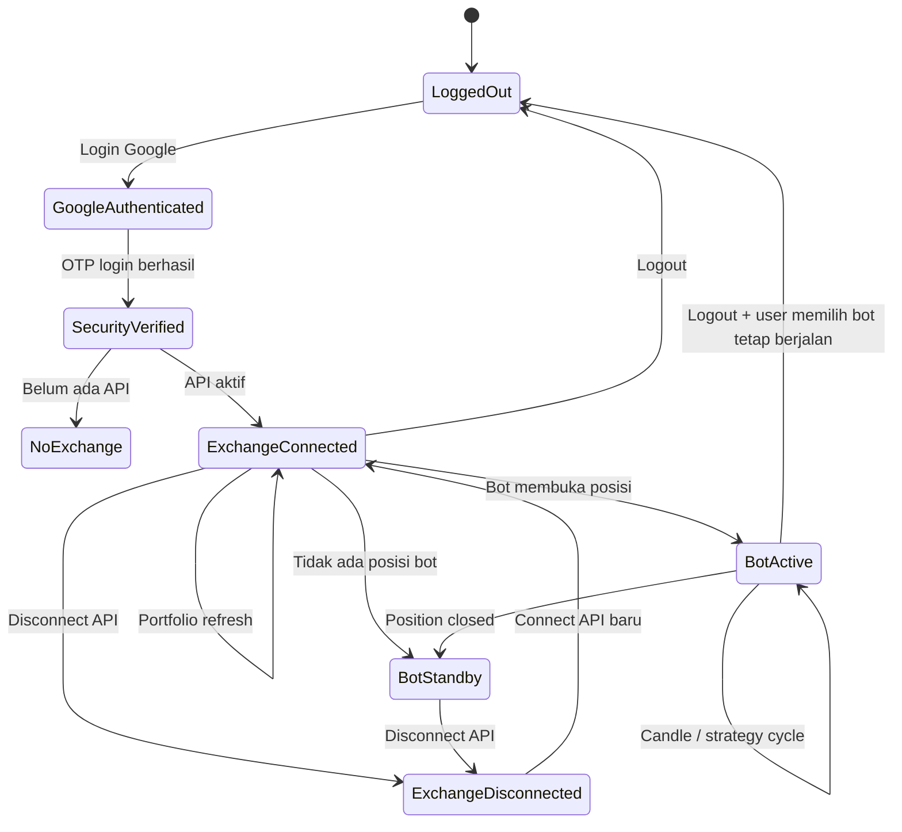

# GAIN NiagaKoin — Audit & Skema Exchange, Identitas Gmail, Portofolio, dan Posisi Bot

**Versi:** v1.0
**Tanggal:** 2 Oktober 2026
**Basis:** source GAIN NiagaKoin v4.2.4.16 + screenshot runtime 2 Oktober 2026
**Status:** audit implementasi + perbaikan UX/state synchronization

---

## 1. Ringkasan Eksekutif

Ada dua masalah yang terlihat pada Home:

1. **`Aset Koin Alokasi` kadang menjadi `0.00 USDT` walaupun exchange sudah tersambung dan aset riil terdeteksi.**
2. **`Posisi Trading Aktif = 0` masih menampilkan pesan `Hubungkan API Exchange` walaupun API exchange sudah tersambung.**

Keduanya berasal dari dua konsep data yang sebelumnya tercampur:

- **Aset exchange riil** = saldo/koin yang benar-benar ada di exchange dan diperoleh melalui API exchange.
- **Posisi bot aktif** = posisi yang sedang dikelola oleh engine bot GAIN.

Exchange tersambung **tidak otomatis berarti ada posisi bot aktif**. User dapat mempunyai aset ZEC/ETH/BTC di exchange tetapi belum menjalankan bot apa pun.

Sebaliknya, posisi bot aktif harus berasal dari state bot/runner dan bukan sekadar dari jumlah aset yang terlihat di wallet exchange.

---

# 2. Temuan Masalah #1 — `Aset Koin Alokasi 0.00 USDT`

## 2.1 Apa yang terjadi

Pada Home, field sebelumnya dirender langsung dari:

```ts
wallet.allocatedAssetUsdt
```

Padahal ketika API exchange berhasil terhubung, sumber data yang lebih relevan adalah:

```ts
wallet.connectedExchange.portfolioAssets
wallet.connectedExchange.totalPortfolioUsdt
wallet.connectedExchange.usdtBalance
```

Source juga mempunyai polling wallet server setiap beberapa detik. Response `/api/account/state` tidak membawa valuasi aset exchange secara lengkap. Akibatnya state lokal yang sebelumnya berisi nilai alokasi dapat tertimpa oleh snapshot wallet baru yang `allocatedAssetUsdt`-nya kembali ke `0`.

Ini menjelaskan pola seperti:

```text
Connect Binance Testnet
        ↓
Portfolio exchange terbaca
        ↓
Aset koin = ~$3,475
        ↓
UI sempat menampilkan nilai tersebut
        ↓
Polling account state masuk
        ↓
wallet.allocatedAssetUsdt kembali 0
        ↓
UI menampilkan 0.00 USDT
```

Jadi angka `0.00` pada kondisi tersebut **bukan berarti aset exchange hilang**.

---

## 2.2 Data yang seharusnya menjadi sumber kebenaran

Untuk bagian **Aset Koin Alokasi**, urutan sumber data sekarang adalah:

1. Jumlah `valueUsdt` seluruh `portfolioAssets` exchange aktif.
2. Jika portfolio asset belum tersedia tetapi `totalPortfolioUsdt > usdtBalance`, gunakan:

```text
totalPortfolioUsdt - usdtBalance
```

3. Jika keduanya belum tersedia, gunakan fallback `wallet.allocatedAssetUsdt`.

Dengan demikian, pada contoh screenshot:

```text
Kas USDT exchange       ≈ $100,422.98
Aset koin                ≈ $3,475.28
Total portfolio exchange ≈ $103,898.26
```

Nilai `Aset Koin Alokasi` tidak lagi bergantung pada saldo internal GAIN yang memang dapat bernilai `0`.

---

# 3. Temuan Masalah #2 — Posisi Trading Aktif = 0 tetapi masih disuruh Connect API

## 3.1 Mengapa angka `0` sebenarnya bisa benar

Source Home menghitung posisi aktif dari:

```ts
positions.filter(
  (p) => p.status === 'active' || p.status === 'averaging'
)
```

Data `positions` tersebut merepresentasikan posisi yang diketahui aplikasi/bot, bukan seluruh aset yang ada di exchange.

Karena itu kondisi berikut valid:

```text
API Exchange: TERHUBUNG
Exchange Asset: ZEC, DASH, NEO, ADA, dll.
Bot GAIN: belum aktif / tidak memiliki posisi

Posisi Trading Aktif = 0
```

Jadi **angka 0 tidak boleh otomatis dianggap sebagai kegagalan koneksi API**.

---

## 3.2 Masalah sebenarnya adalah teks UX

Pesan lama selalu menampilkan:

> Hubungkan API exchange Anda untuk sinkronisasi saldo riil atau aktifkan bot averaging.

dan tombol:

> Hubungkan API Exchange

Padahal ketika exchange sudah tersambung, kalimat tersebut salah konteks.

### Perilaku baru

Jika exchange **belum terhubung**:

```text
Belum Ada Posisi Trading Aktif

Hubungkan API exchange Anda untuk sinkronisasi saldo riil
atau aktifkan bot averaging.

[Hubungkan API Exchange]
[Lihat Pair Standby]
```

Jika exchange **sudah terhubung tetapi tidak ada bot position**:

```text
Belum Ada Posisi Bot Aktif

BINANCE Testnet sudah terhubung.
Saldo dan aset exchange ditampilkan pada Distribusi Portofolio Koin.
Saat ini belum ada bot GAIN yang memegang posisi aktif.

[Buka Bot Matrix]
[Lihat Pair Standby]
```

Dengan demikian user tidak lagi diberi pesan yang kontradiktif.

---

# 4. Definisi Data yang Harus Dipahami User

| Data | Arti |
|---|---|
| GAIN Liquid Balance | Saldo internal/wallet GAIN, bukan saldo exchange spot |
| Exchange USDT Balance | USDT yang benar-benar tersedia pada exchange yang tersambung |
| Exchange Portfolio Assets | Koin non-USDT yang benar-benar terdeteksi dari exchange |
| Aset Koin Alokasi | Nilai USDT aset koin pada exchange aktif |
| Posisi Bot Aktif | Posisi yang sedang dikelola oleh bot/runner GAIN |
| Bot Standby | Konfigurasi bot ada, tetapi tidak sedang memiliki posisi aktif |
| API Connected | Kredensial exchange tersimpan dan status koneksi aktif |

**Kesimpulan penting:**

```text
API Connected ≠ Bot Active

Exchange Asset ≠ Bot Position

GAIN Liquid Balance ≠ Exchange Balance
```

---

# 5. Skema Identitas Gmail → GAIN → Exchange

Arsitektur backend saat ini mengikat kredensial exchange berdasarkan kombinasi:

```text
Firebase UID / User GAIN
        +
Exchange
```

Database mempunyai constraint:

```text
UNIQUE(user_id, exchange)
```

Kredensial exchange disimpan terenkripsi di PostgreSQL.

Browser tidak menjadi tempat penyimpanan secret exchange permanen.

Secara konseptual:

```text
Gmail A
  ↓
Firebase UID A
  ↓
GAIN User A
  ↓
Binance Credential A
  ↓
Bot A

Gmail B
  ↓
Firebase UID B
  ↓
GAIN User B
  ↓
Binance Credential B
  ↓
Bot B
```

Kedua user tersebut **bukan user GAIN yang sama**.

---

# 6. Skenario A — User Memutuskan Koneksi API Exchange

Contoh:

```text
Gmail A
  └── Binance Testnet
```

User memilih:

```text
Putuskan API Binance
```

Alur server:

1. GAIN mencari bot milik Firebase UID tersebut.
2. Bot pada exchange tersebut dijeda.
3. GAIN mencoba membatalkan open order.
4. Jika seluruh open order dapat dikonfirmasi batal, kredensial exchange di database diberi status `REVOKED`.
5. UI menghapus koneksi exchange dari user tersebut.
6. Data posisi UI ditandai standby/inactive.

Jika pembatalan open order tidak dapat dipastikan, server **tidak langsung menghapus credential**. Ini penting karena posisi/order yang statusnya belum pasti tidak boleh dianggap aman.

### Setelah disconnect

```text
Gmail A
  ↓
GAIN User A
  ↓
Binance = DISCONNECTED
  ↓
Credential = REVOKED
  ↓
Bot Binance = PAUSED
```

Saldo Binance **tidak dipindahkan ke GAIN**.

---

# 7. Skenario B — Disconnect, lalu Connect dengan Gmail yang Berbeda

Misalnya awalnya:

```text
Gmail A → Binance API A
```

User disconnect.

Kemudian logout dan login:

```text
Gmail B
```

Lalu Gmail B memasukkan API Binance.

Maka sistem membuat/menyimpan credential berdasarkan user B:

```text
Gmail A / UID A
    Binance credential A = REVOKED

Gmail B / UID B
    Binance credential B = ACTIVE
```

Ini adalah dua namespace berbeda.

### Yang TIDAK terjadi

GAIN tidak boleh:

- membawa credential Gmail A ke Gmail B;
- membawa saldo internal Gmail A ke Gmail B;
- membawa posisi bot Gmail A menjadi posisi Gmail B;
- menganggap Gmail B sebagai pemilik koneksi Gmail A.

### Yang terjadi

Gmail B harus melakukan koneksi exchange sendiri.

---

# 8. Skenario C — Tidak Disconnect, Langsung Login dengan Gmail Berbeda

Ini adalah skenario yang paling mudah disalahpahami user.

Misalnya:

```text
Gmail A
  ↓
Binance API A
  ↓
Bot A aktif
```

User logout tetapi ketika dialog logout muncul, user memilih opsi untuk **membiarkan bot tetap berjalan**.

Kemudian user login dengan:

```text
Gmail B
```

Maka:

```text
Gmail A
  └── Bot A dapat tetap berjalan di backend

Gmail B
  └── Session UI baru
  └── Tidak otomatis mendapatkan credential A
```

Ini penting: **logout UI tidak sama dengan mematikan bot backend jika user memilih membiarkan bot berjalan.**

Jika Gmail B kemudian menghubungkan Binance API B, kedua akun GAIN dapat mempunyai runner berbeda.

---

# 9. Skenario D — Gmail Berbeda tetapi API Key Binance yang Sama

Contoh:

```text
Gmail A → Binance API X
Gmail B → Binance API X
```

Secara teknis database GAIN dapat menyimpan credential tersebut pada dua user GAIN berbeda karena constraint-nya adalah:

```text
(user_id, exchange)
```

bukan:

```text
(exchange_account_id)
```

Akibatnya dua akun GAIN dapat secara tidak sengaja menunjuk ke **akun Binance yang sama**.

### Risiko

Jika:

```text
Bot A → Binance API X
Bot B → Binance API X
```

maka keduanya dapat mengirim order ke akun exchange yang sama.

Dapat terjadi:

```text
Bot A BUY BTC
Bot B SELL BTC

Bot A memakai saldo USDT
Bot B juga memakai saldo USDT yang sama

Bot A menganggap positionQty = X
Bot B menganggap positionQty = Y
```

Hal ini berpotensi menghasilkan konflik strategi karena kedua bot tidak mengetahui bahwa credential exchange tersebut dipakai oleh user GAIN lain.

**Sistem saat ini belum mempunyai bukti identitas akun exchange lintas-user yang cukup untuk memblokir skenario tersebut secara otomatis.**

---

# 10. Skenario E — Gmail Sama, Exchange Berbeda

Contoh:

```text
Gmail A
 ├── Binance
 └── Bitget
```

Database mendukung koneksi multi-exchange dalam satu user GAIN.

Konsepnya:

```text
Firebase UID A
 ├── Binance credential
 └── Bitget credential
```

User dapat memilih exchange aktif.

### Yang harus berubah ketika exchange diganti

```text
Active Exchange = Binance
        ↓
Portfolio Binance
        ↓
Balance Binance
        ↓
Bot/runner Binance
```

kemudian:

```text
Active Exchange = Bitget
        ↓
Portfolio Bitget
        ↓
Balance Bitget
        ↓
Bot/runner Bitget
```

Data tidak boleh tercampur.

---

# 11. Skenario F — Gmail Sama, Exchange Sama, API Key Diganti

Contoh:

```text
Gmail A
 └── Binance API lama
```

User memasukkan API baru:

```text
Gmail A
 └── Binance API baru
```

Karena constraint database adalah:

```text
UNIQUE(user_id, exchange)
```

credential lama akan diperbarui/digantikan oleh credential baru.

Konsekuensinya:

```text
Bot Binance yang sebelumnya memakai credential lama
        ↓
harus dipastikan tidak lagi menggunakan credential lama
```

Ini adalah area yang harus diawasi karena mengganti credential bukan sekadar mengganti label UI.

---

# 12. Skenario G — Reload Browser

Setelah reload:

```text
Browser
 ↓
Firebase Auth
 ↓
GAIN UID
 ↓
GET /api/account/state
 ↓
Database credential metadata
 ↓
Portfolio refresh menggunakan credential server
```

Secret API tidak seharusnya dibaca kembali dari localStorage browser.

Credential rahasia tetap berada di server/database terenkripsi.

UI hanya menerima metadata aman seperti:

```text
BINANCE
API_CONNECTED
Testnet
lastSynced
usdtBalance
portfolioAssets
```

---

# 13. Skenario H — Logout dengan Bot Tetap Berjalan

Flow logout mempunyai dua konsep:

### Pilihan 1 — Hentikan bot

```text
Logout
 ↓
Kill Switch
 ↓
Pause bot
 ↓
Cancel open orders
 ↓
Logout Firebase
```

### Pilihan 2 — Biarkan bot berjalan

```text
Logout UI
 ↓
Bot backend tetap berjalan
 ↓
Firebase session user di browser berakhir
 ↓
Bot tetap menjadi milik UID lama
```

Ini penting untuk dipahami ketika user kemudian login dengan Gmail lain.

Gmail baru tidak boleh mengambil alih bot lama.

---

# 14. Skenario I — User Mengira Aset Exchange = Posisi Bot

Contoh screenshot:

```text
ZEC
DASH
NEO
ADA
...

Total aset exchange ≈ $3,475

Posisi Bot Aktif = 0
```

Ini bukan kontradiksi.

Artinya:

```text
Exchange memiliki aset
        ↓
GAIN berhasil membaca aset
        ↓
Tetapi belum ada bot GAIN yang memiliki state posisi aktif
```

Karena itu Home sekarang menggunakan bahasa:

> Belum Ada Posisi Bot Aktif

bukan:

> Belum Ada Posisi Trading Aktif — Hubungkan API Exchange

ketika API sudah tersambung.

---

# 15. Skenario J — Harga Koin Berubah

`Aset Koin Alokasi` memang dapat berubah tanpa ada transaksi baru.

Contoh:

```text
100 ZEC × $30 = $3,000
```

Jika harga menjadi:

```text
100 ZEC × $31 = $3,100
```

maka nilai alokasi berubah $100.

Perubahan seperti ini normal.

Yang **tidak normal** adalah:

```text
$3,475
 ↓
$0
 ↓
$3,475
```

padahal tidak ada disconnect dan aset masih ada.

Perbaikan v1.0 menghilangkan ketergantungan Home pada field wallet yang dapat tertimpa polling.

---

# 16. State Machine yang Direkomendasikan



---

# 17. Model Kepemilikan yang Harus Dipertahankan

```text
Firebase UID
    │
    ├── GAIN Wallet
    │
    ├── Exchange Credential(s)
    │       ├── Binance
    │       ├── Bitget
    │       └── OKX
    │
    ├── Bot Runner(s)
    │
    ├── Trading Positions
    │
    └── Trade History
```

Semua objek tersebut harus selalu memiliki hubungan ke UID GAIN.

Tidak boleh ada aturan seperti:

```text
"Kalau email berubah, ambil saja credential sebelumnya."
```

---

# 18. Rekomendasi UX yang Harus Dipertahankan

## Jika belum connect

```text
Exchange: Belum Terhubung
Aset Exchange: 0
Bot Position: 0

[Hubungkan API Exchange]
```

## Jika sudah connect tetapi belum ada bot

```text
Exchange: Binance Testnet ✓
Aset Koin: $3,475.28
Bot Position: 0

Belum Ada Posisi Bot Aktif

[Buka Bot Matrix]
```

## Jika bot aktif

```text
Exchange: Binance Testnet ✓
Aset Koin: $3,475.28
Bot Position: 2

BTC/USDT — ACTIVE
ZEC/USDT — AVERAGING
```

## Jika disconnect

```text
Exchange: Disconnected
Aset Exchange: tidak ditampilkan sebagai data live
Bot: paused / verified state
```

---

# 19. Perubahan Implementasi pada Patch Ini

## A. HomeView

`Aset Koin Alokasi` sekarang dihitung dari:

```text
connectedExchange.portfolioAssets
        ↓
Σ valueUsdt
```

dengan fallback ke:

```text
totalPortfolioUsdt - usdtBalance
```

kemudian fallback terakhir ke:

```text
wallet.allocatedAssetUsdt
```

## B. Wallet synchronization

Snapshot wallet sekarang mengisi `allocatedAssetUsdt` berdasarkan portfolio exchange aktif agar polling account state tidak lagi mengembalikan field tersebut ke `0` secara keliru.

## C. Multi-exchange local state

Metadata koneksi lokal sekarang diprioritaskan per exchange:

```text
gain_exchange_<uid>_<exchange>
```

sementara key lama dipertahankan sebagai fallback kompatibilitas.

## D. Disconnect local state

Disconnect exchange sekarang menghapus state lokal yang sesuai dengan exchange tersebut, bukan hanya satu state generik user.

## E. Empty-state posisi

Jika exchange sudah connected:

```text
Belum Ada Posisi Bot Aktif
```

bukan lagi pesan yang meminta user menghubungkan API.

---

# 20. Hal yang Belum Boleh Dianggap Sama

Jangan menggunakan satu angka untuk semua konteks.

### `wallet.liquidBalance`

Saldo internal GAIN.

### `wallet.connectedExchange.usdtBalance`

Saldo USDT exchange aktif.

### `wallet.connectedExchange.totalPortfolioUsdt`

Total valuasi exchange, termasuk aset koin dan USDT.

### `wallet.connectedExchange.portfolioAssets`

Daftar aset exchange non-USDT yang berhasil dinilai dalam USDT.

### `positions`

State posisi trading aplikasi/bot.

### `engineBots`

Runtime bot backend; untuk posisi bot yang sedang berjalan, ini harus diperlakukan sebagai sumber runtime yang lebih kuat daripada cache UI.

---

# 21. Kesimpulan

Masalah screenshot bukan satu masalah tunggal.

Ada dua lapisan:

### Masalah data

`allocatedAssetUsdt` dapat tertimpa oleh polling wallet sehingga sempat kembali `0` walaupun portfolio exchange memiliki aset.

### Masalah semantik UX

`Posisi Trading Aktif = 0` tidak berarti API belum tersambung. Itu berarti belum ada posisi bot aktif.

Setelah perbaikan, aplikasi membedakan secara eksplisit:

```text
LOGIN IDENTITY
      ↓
GAIN USER
      ↓
EXCHANGE CONNECTION
      ↓
EXCHANGE PORTFOLIO
      ↓
BOT RUNNER
      ↓
BOT POSITION
```

Dan skema Gmail berbeda juga dipisahkan:

```text
Gmail A → UID A → Credential A → Bot A → Position A
Gmail B → UID B → Credential B → Bot B → Position B
```

Keduanya tidak boleh saling mengambil state hanya karena memakai browser atau exchange yang sama.

**Catatan penting:** Jika Gmail A dan Gmail B memasukkan API key exchange yang benar-benar sama, sistem saat ini belum mempunyai mekanisme lintas-user yang cukup untuk memastikan bahwa kedua GAIN account tersebut menunjuk ke akun exchange yang sama atau untuk mencegah dua bot mengakses akun exchange tersebut secara bersamaan. Ini merupakan hardening lanjutan yang layak ditambahkan sebelum penggunaan multi-user/multi-Gmail secara luas.
